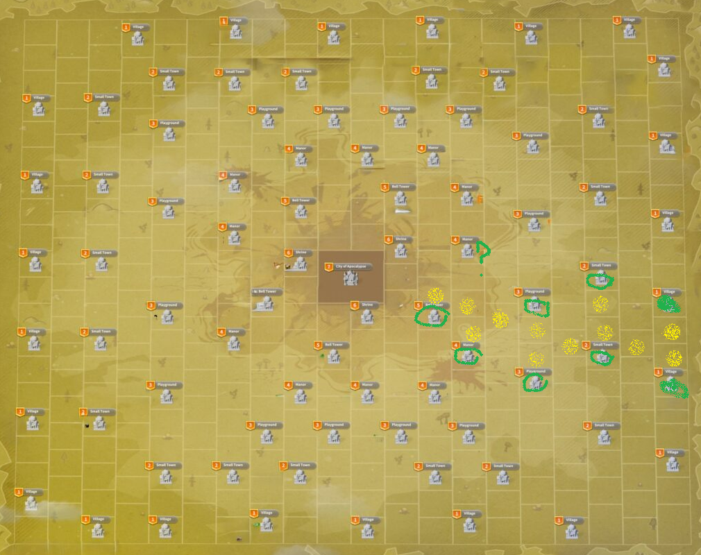

# principle of breach troop loss

When a base is attacked and the defender loses the fight, the base is "breached" and a penalty of troop killed is inflicted to the defender.
The number of troop is variable, but depends on the level of the target and the technology researched by both players.

Breaching a base means having a squad strong enough to win the fight.

But there is one exception...

Undefended bases won't lose troops during fight, but if they are attacked they always lose, and the breach penalty is applied fully

## here comes the crow

A single lvl 1 blue hero from a level 1 HQ is going to do the same damage when breaching base as the most potent squad of the fattest whale. This is the crow.
|Loki can win a fight | |
|-|-|
|  |  |

|After a succesful hit, check the battle reports :||
|-|-|
| the base is breached and there are breach penalty losses : hit the base until it is ashed. It usually does around 4 thousand troop kills in one ashing... |  |
| the base is breached but no troops are lost : find another target |  |

## the crowmaster observes the battlefield and reports information

The crow master wants to fight on their term. They are actively scouting to find undefended bases.

Then when a scout arrives, the crow master immediately checks the report

* if the base is undefended, the crow attacks
* if the base is defended by extremely powerful squads, the report can be ignored
* if the base is defended by low level squads, even if garrisoned, the report should be shared to allies for eradication

The crow should be vigilant to every troop movement : garrisons, troops going out on attacks or coming back... The report information becomes obsolete fast, and seeing troops go out is a good information of an open vulnerability

## the crow looms over its prey

When the report is conclusive and the crow should attack the base, if it is too far from the target, it will take a long time to attack.

The best way to reach destination is to target a mine behind the objective : the move speed is much faster ! And also the targeted player is not informed of the incoming attack until the last second.

When a crowmaster starts to be more at ease with the tactic, they can try to time the arrival of the scout to the crow behind in the neighbourood of the targets.

## The crow master doesn't fear to be ashed.
Either because the crowmaster has already lost all troops, or because they uses some of the troop conservation tactics, there should never be troops on the training ground while the crowmaster is hunting for preys.
At first, it is a good idea to practice further from the mud, where the range is dissuading players from counter attacking.
When the tactic gets mastered, going in the mud is not a problem and the more crows there are, the less likely any player is to be a target.

## crow and hammer
Another semi advanced tatic for player with a good power level, is to use a crow and a regular squad in combination.
The crow is a good way to ashe and destroy troops safely, but if the crow "dies" on the defense (because of a fast garrions or a player activating defense) and having a 